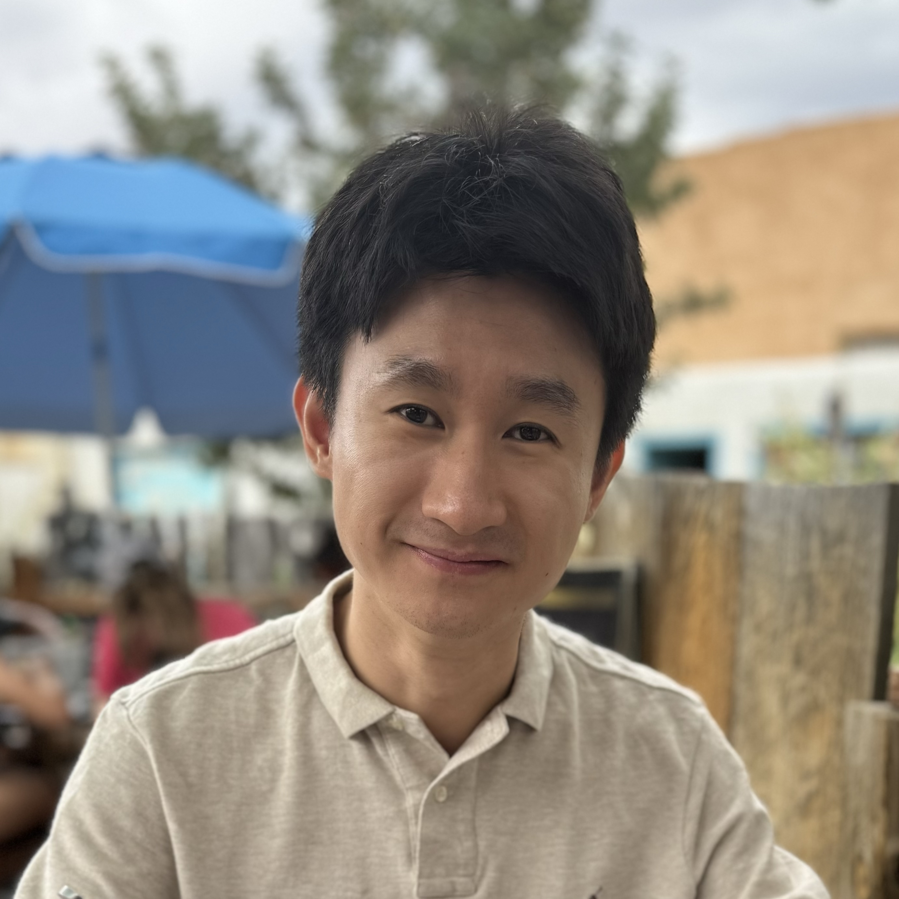

# **Daoce Wang 王道策**

  

    
  

  

    
Ph.D. Candidate

    Indiana University 
    Email: <a href="mailto:daocwang@iu.edu">daocwang@iu.edu</a> 
    Phone: 352‑871‑4124 
     <a href="photo/CV_Daoce_Wang.pdf" target="_blank" style="text-decoration: underline;">Download CV</a>
  

<!-- Add responsive styles -->

# **Biography**
I am a 5th-year Ph.D. student at Indiana University, Bloomington, and expect to graduate in May 2025, under the supervision of Dr. [Dingwen Tao](https://www.dingwentao.com/) and Dr. [Fengguang Song](https://homes.luddy.indiana.edu/fgsong/). I received my bachelor's degree in Computer Science from the University of Electronic Science and Technology of China in 2018 and my master's degree in Computer Science from the University of Florida in 2020. I was a summer research intern at Los Alamos National Laboratory in 2021, 2022, 2023, and 2024.
My Ph.D. research focuses on designing efficient data reduction approaches for extreme-scale scientific simulations on high-performance computing (HPC) systems.

---

# **Research Interests**
* High-Performance Computing
* Scientific Data Compression
* Scientific Visualization
* Machine Learning
* Fault Tolerance

---

# **Education**

- **Ph.D. Candidate** in Computer Engineering  
  Indiana University, Bloomington, IN (2022 - 2025)  
  *Advisors*: Dr. Fengguang Song and Dr. Dingwen Tao  

- **Ph.D. Candidate** in Computer Science  
  Washington State University, Pullman, WA (2020 - 2022)  
  *Advisor*: Dr. Dingwen Tao

- **M.S. in Computer Science**  
  University of Florida, Gainesville, FL (2020)

- **B.S. in Computer Science and Engineering**  
  University of Electronic Science and Technology of China, Chengdu, China (2018)

---

# **Selected Publications**

### **NeurIPS '24**
Jinda Jia, Cong Xie, Hanlin Lu, **Daoce Wang**, Hao Feng, Chengming Zhang, Baixi Sun, Haibin Lin, Zhi Zhang, Xin Liu, Dingwen Tao.\
SDP4Bit: Toward 4-bit Communication Quantization in Sharded Data Parallelism for LLM Training.\
The Thirty-Eighth Annual Conference on Neural Information Processing Systems, Vancouver, Canada, December 9–12, 2024.

### **SC '24**
**Daoce Wang**, Pascal Grosset, Jesus Pulido, Tushar M. Athawale, Jiannan Tian, Kai Zhao, Zarija Lukic, Axel Huebl, Zhe Wang, James Ahrens, and Dingwen Tao.\
A High-Quality Workflow for Multi-Resolution Scientific Data Reduction and Visualization.\
The International Conference for High Performance Computing, Networking, Storage, and Analysis, Atlanta, GA, USA, November 17–22, 2024.

### **TPDS '24**
**Daoce Wang**, Jesus Pulido, Pascal Grosset, Jiannan Tian, Sian Jin, Kai Zhao, James Ahrens, and Dingwen Tao.\
TAC+: Optimizing Error-Bounded Lossy Compression for 3D AMR Simulation.\
IEEE Transactions on Parallel and Distributed Systems.

### **EUROSYS '24**
Sian Jin, Sheng Di, Frédéric Vivien, **Daoce Wang**, Yves Robert, Dingwen Tao, and Franck Cappello.\
Concealing Compression-Accelerated I/O for HPC Applications through In Situ Task Scheduling.\
Proceedings of the Nineteenth European Conference on Computer Systems, Athens, Greece, April 22–25, 2024.

### **SC '23**
**Daoce Wang**, Jesus Pulido, Pascal Grosset, Jiannan Tian, Sian Jin, Houjun Tang, Jean Sexton, Sheng Di, Zarija Luki, Kai Zhao, Bo Fang, Franck Cappello, James Ahrens, and Dingwen Tao.\
AMRIC: A Novel In Situ Lossy Compression Framework for Efficient I/O in Adaptive Mesh Refinement Applications.\
The International Conference for High Performance Computing, Networking, Storage, and Analysis, Denver, Colorado, USA, November 12–17, 2023.

### **HPDC '22**
**Daoce Wang**, Jesus Pulido, Pascal Grosset, Jiannan Tian, James Ahrens, and Dingwen Tao.\
TAC: Optimizing Error-Bounded Lossy Compression for Three Dimensional Adaptive Mesh Refinement Simulations.\
ACM International Symposium on High-Performance Parallel and Distributed Computing, Minneapolis, Minnesota, USA, June 27–July 1, 2022.

### **CLUSTER '21**
Bo Fang\*, **Daoce Wang\***, Sian Jin, Quincey Koziol, Zhao Zhang, Qiang Guan, Suren Byna, Sriram Krishnamoorthy and Dingwen Tao. (\* equal contribution)\
Characterizing Impacts of Storage Faults on HPC Applications: A Methodology and Insights.\
The 2021 IEEE International Conference on Cluster Computing, Portland, OR, USA, September 7-10, 2021.

# **Workshop & Posters**

### Doctoral Showcase
**Daoce Wang**, Dingwen Tao.\
Designing Efficient Data Reduction Approaches for Multi-resolution Simulations on HPC Systems.\
SC ’24 Doctoral Showcase.

### DRBSD-10 
Yanni Etchi, **Daoce Wang**, Pascal Grosset, Terece Turton, James Ahrens, and David Rogers.\
An Exploration of How Volume Rendering is Impacted by Lossy Data Reduction.\
The 10th International Workshop on Data Analysis and Reduction for Big Scientific Data (in conjunction with SC 24), Atlanta, GA, USA, Nov 18, 2024.\ 
**Best Paper Runner-up**

### DRBSD-10 
Qing Zheng, Brian Atkinson, **Daoce Wang**, Jason Lee, John Patchett, Dominic Manno, and Gary Grider.\
Accelerating Viz Pipelines Using Near-Data Computing: An Early Experience.\
The 10th International Workshop on Data Analysis and Reduction for Big Scientific Data (in conjunction with SC 24), Atlanta, GA, USA, Nov 18, 2024.

### DRBSD-9
**Daoce Wang**, Jesus Pulido, Pascal Grosset, Jiannan Tian, James Ahrens, and Dingwen Tao.\
Analyzing Impact of Data Reduction Techniques on Visualization for AMR Applications Using AMReX Framework.\
The 9th International Workshop on Data Analysis and Reduction for Big Scientific Data (in conjunction with SC 23), Denver, CO, USA, Nov 12, 2023.

### SC '21 Poster 
**Daoce Wang**, Jesus Pulido, Pascal Grosset, Sian Jin, Jiannan Tian, James Ahrens, and Dingwen Tao.\
In-Situ Data Reduction for AMR-Based Cosmology Simulations.\
ACM Student Research Competition: Graduate Posters at SC 21.

---

# **Experience**

### Research Intern, Los Alamos National Laboratory
2024 May – 2024 August  

### Research Intern, Los Alamos National Laboratory
2023 May – 2023 August  

### Research Intern, Los Alamos National Laboratory
2022 June – 2022 August  

### Research Intern, Los Alamos National Laboratory
2021 June – 2021 August  

# **Reviewer/Sub-reviewer**
- SC (2024, 2022)
- HPDC (2024, 2023)
- ICS (2023, 2022, 2022)
- IPDPS (2024, 2023)
- AAAI (2022)
- Euro-Par (2023)
- ICPP (2023)
- CCGRID (2023, 2022)
- HiPC (2023)
- BigData (2021)
- CLUSTER (2021)
- TVCG, TPDS, TC, TBD, TCC, FGCS
